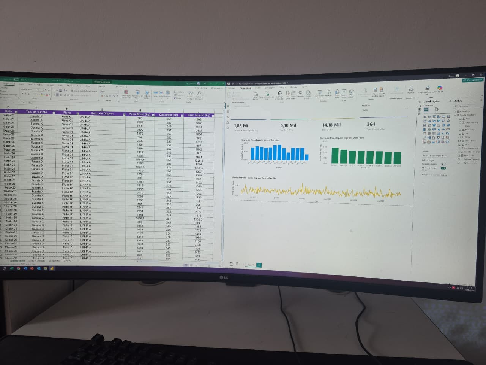

<div align="center">

# 📊 Scrap Rate Monitoring Dashboard

**Power BI · Excel · Power Query · Data Modeling**

[](https://powerbi.microsoft.com)
[](https://microsoft.com/excel)
[](#)
[](#)

*From zero visibility to data-driven decisions — a full data collection and visualization solution built from scratch for scrap rate monitoring in a manufacturing environment.*

</div>

---

## 🧩 The Problem

The engineering team was frequently questioned about **scrap return rates from a specific production sector** — and how they impacted downstream processes across the plant.

**The issue: this data didn't exist anywhere.**

There was no system, no form, no record. Scrap volume was happening, influencing production efficiency and quality outcomes, but it was completely invisible to management and engineering.

---

## 💡 The Solution

I designed and implemented an **end-to-end data pipeline** to capture, structure, and visualize this missing information:

1. **Identified the gap** — recognized that scrap data was undocumented and impacting decisions
2. **Designed a data collection form** — built a structured Excel workbook that operators could fill in manually at the point of production
3. **Built the ETL layer** — used Power Query to clean, validate, and transform operator inputs into a consistent data model
4. **Delivered a Power BI dashboard** — gave engineering and management a clear, visual tool to analyze scrap trends, identify problem sectors, and correlate scrap rates with production KPIs

---

## 📸 Dashboard Preview



> *All data has been anonymized for confidentiality purposes.*

The dashboard includes:

- **Scrap volume by sector** — which areas generate the most return
- **Time-series trend** — how scrap rates evolve day over day, week over week
- **Cross-sector impact analysis** — how scrap from one sector cascades into downstream production steps
- **Operator input traceability** — data tied to shift, line, and entry timestamp

---

## 🔄 Workflow

```
Problem identified (missing data)
        ↓
Excel form designed for operator input
        ↓
Manual data entry by production operators
        ↓
Power Query (cleaning, validation, transformation)
        ↓
Data Model (relationships & measures)
        ↓
Power BI Dashboard (analysis & decision support)
        ↓
Engineering & management insights
```

---

## ✨ Features

| Feature | Description |
|---|---|
| 🗂️ **Data Collection Form** | Structured Excel sheet designed for operator-level daily input |
| 📉 **Scrap Rate Tracking** | Volume and frequency of scrap returns by sector |
| 🔗 **Cross-sector Impact** | Visibility into how one sector's scrap affects others |
| 📈 **Trend Analysis** | Historical patterns to support root cause analysis |
| 💡 **Engineering Support** | Dashboard built specifically for engineering decision-making |

---

## 🛠️ Technologies

- **Power BI** — Interactive dashboard and report development
- **Excel** — Operator data entry form and raw data storage
- **Power Query** — ETL pipeline: cleaning, validation, and transformation
- **Data Modeling** — Relationships and DAX measures for cross-sector analysis

---

## 💼 Impact

Before this project, engineering had **no data** to answer questions about scrap return rates or their production impact.

After implementation:
- Scrap data became **visible and trackable** for the first time
- Engineering gained a tool to **identify high-scrap sectors** and prioritize interventions
- Management could correlate scrap rates with **production efficiency losses**
- The Excel form gave operators a **simple, low-friction way** to contribute to data quality

---

## 📝 Notes

- All data is **confidential** — no real production data is shared in this repository
- The Excel form was designed to be **operator-friendly** — no technical knowledge required
- Dashboard refresh requires only updating the source Excel file — **no IT dependency**

---

<div align="center">

Made with 📊 by [miguelluan5210](https://github.com/miguelluan5210)

</div>
